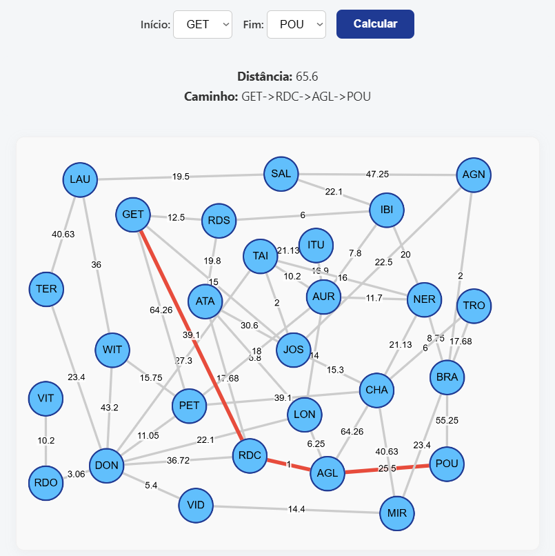

# 🌐 Projeto Grafos Interativo

Projeto acadêmico desenvolvido para **visualização, estudo e experimentação com grafos**.  
Ele possibilita explorar conceitos fundamentais como **vértices, arestas, caminhos, pesos e algoritmos de menor caminho** em uma interface totalmente interativa.

---

## ✨ Funcionalidades

- 📍 Representação visual de grafos (cidades como vértices e estradas como arestas).  
- 🔗 Arestas **ponderadas e bidirecionais**, simulando estradas fictícias com valores de distância, qualidade e tipo.  
- 🖱️ Interface **interativa**:
  - Arraste os vértices livremente.  
  - Escolha **origem** e **destino** para calcular o menor caminho.  
  - O caminho mais curto é **destacado no grafo** em tempo real.  
- 📚 Conteúdo didático sobre:
  - Conceitos, classificações e representações de grafos.  
  - Algoritmos clássicos: **BFS, DFS e Dijkstra**.  
- 🎨 Interface simples e responsiva feita com **HTML, CSS e JavaScript**.  

---

## 🛠️ Tecnologias Utilizadas

- **HTML5** → Estrutura das páginas  
- **CSS3** → Estilização e responsividade  
- **JavaScript (Cytoscape.js)** → Manipulação e visualização do grafo  
- **Python** → Backend e lógica de grafos  
- **Flask** → API para comunicação entre frontend e backend  

---

## 🚀 Como Usar

1. Clone este repositório:  
   ```bash
   git clone https://github.com/Johannmk1/ProjetoGrafos.git
   ```
2. Instale as dependências Python:  
   ```bash
   pip install flask
   ```
3. Inicie a aplicação:  
   ```bash
   python app.py
   ```
4. Abra no navegador:  
   ```
   http://localhost:5000
   ```
5. Navegue pelo menu superior:  
   - **Conceito | História | Tipos | Regras | Exemplos | Algoritmos | Curiosidades | Prática**  
6. Vá até a seção **Prática** para interagir com o grafo:  
   - Escolha o vértice de **início** e **fim**.  
   - Clique em **Calcular**.  
   - Veja o menor caminho destacado.  
   - Experimente arrastar os vértices e testar diferentes combinações.  

---

## 📸 Demonstração



---

## 📂 Estrutura do Projeto

```
DijkstraEmPython\
├── src\
|    ├── static\
|    │   ├── img\              # Imagens do projeto
|    │   ├── index.html        # Página principal
|    │   ├── style.css         # Estilos do projeto
|    │   └── script.js         # Lógica de interação com o grafo
|    ├── DadosGrafo.py         # Dados e configuração inicial do grafo
|    ├── Grafo.py              # Implementação da estrutura de grafos
|    └── app.py                # Backend Flask
├── vercel.json                # Configuração de deploy
└── README.md                  # Documentação
```

---

## 🎓 Objetivo Acadêmico

Este projeto foi desenvolvido como material de apoio para a disciplina de **Estruturas de Dados**.  
O objetivo é **tornar o estudo de grafos mais visual, prático e dinâmico**, conectando teoria e prática de forma interativa.

---

## 🔗 Autores GitHub 

- [**Johann Malkowski**](https://github.com/Johannmk1)  
- [**Raíssa Sofka Mazzi**](https://github.com/Raissa-SM)  
